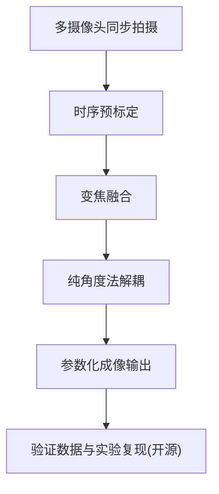

# Param Imaging — 多摄像头同步拍摄的参数化成像

> 一种基于多摄像头同步拍摄的参数化成像方法（配套发明专利）。开源层含验证数据、复现环境与实验报告；核心算法由专利保护，保持闭源。


## 核心贡献（Key Contributions）

本仓库对应的研究在底层实验中形成若干独立贡献，全部可通过本仓库的验证数据与实验报告复现：

- **领域通用公式修正**：经典线性化测距公式在 50m 外会低估误差约 2.5 倍，本工作给出修正模型。
- **短基线远距失效定量模型**：对短基线配置在远距离场景下的失效机制给出定量描述。
- **纯角度法解耦**：仅依赖角度信息完成解耦，相对误差对比（0.47% vs 127.8%）见 A3 实验。

## 技术架构



## 快速开始（3 步）

```bash
# 1. 克隆仓库
git clone <repo-url> param-imaging && cd param-imaging

# 2. 校验数据哈希（种子 0x612 驱动的实验产物）
make verify

# 3. 查看实验复现说明与结果
cat docs/experiments.md
```

## 工程命令（Makefile）

| 命令 | 作用 |
|------|------|
| `make check` | 全量门禁：数据校验 + 依赖检查 + 镜像构建 |
| `make verify` | 数据哈希链校验（HAF003 记录管理） |
| `make build` | 构建 Docker 镜像 |
| `make test` | 在 Docker 环境锁内运行实验复现 |

> Docker 复现环境锁（`validation_package_v2.0` 对应镜像）与 `data/` 验证数据包已接入，第 2 步可校验完整哈希链。数据包上传后执行 `scripts/checksum.sh generate` 生成真实哈希。

## 文档结构

| 路径 | 内容 | 层级 |
|------|------|------|
| `README.md` | 落地页：简介、核心贡献、快速开始、专利关联 | 第一层 |
| `docs/theory.md` | 底层原理：短基线远距失效模型与公式修正推导 | 第二层 |
| `docs/experiments.md` | A3 实验详情、种子与 Docker 环境锁说明 | 第二层 |
| `docs/references.md` | 全量文献综述与同行对比 | 第二层 |
| `data/` | 验证数据包 `validation_package_v2.0`（含 120 组实验数据） | 第三层 |
| `.github/workflows/` | CI/CD/CodeQL 自动化流水线 | 工程层 |
| `Makefile` | 一键门禁命令（check/verify/build/test） | 工程层 |
| `Dockerfile` | 多阶段构建，锁定复现环境 | 工程层 |

## 专利关联与开源范围

- **配套专利**：《一种基于多摄像头同步拍摄的参数化成像方法》，申请号 `202611094798.X`（已进入实质审查）。
- **开源范围**：本仓库仅开源验证数据、复现环境配置与实验报告。核心算法（时序预标定、变焦融合逻辑、纯角度法解耦实现）不随本仓库分发。
- **法律声明**：本仓库依据 Apache License 2.0 授权，仅授予著作权许可，**不构成专利实施许可**。任何商业实施需另行取得专利权人授权。
- **实验证据链**：本仓库实验由全局随机种子 `0x612` 驱动，产物哈希链见 `checksums.sha256`，与专利申请实审提交的 `validation_package_v2.0` 保持一致。

## 许可证

[Apache License 2.0](LICENSE)，含明确的专利授权条款与商标保护。
